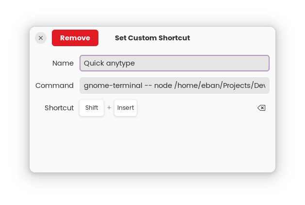

# AnytypeCapture 

This project aims to provide a quick and efficient way to capture any thought to your [AnyType](https://github.com/anyproto/anytype-ts) second brain. It leverages the protobuf GRPC API exposed by AnyType.

**Disclaimer:** This project is not affiliated nor endorsed by the official Anytype project.


## Installation

To install AnytypeCapture, follow these steps:

1. Clone the repository: `git clone https://github.com/ebanDev/AnytypeCapture.git`
2. Navigate to the project directory: `cd AnytypeCapture`
3. Install `lsof` (https://command-not-found.com/lsof)
4. Install the required dependencies: `npm install`
5. Create the .env file: `touch .env`
6. Start the application: `npm start`

## Usage

To use AnytypeCapture, you can either use it directly from this directory, or create an alias to run the capture at any moment 

```sh
alias capture="node THISDIR/index.js"
```

You could also bind it to a shortcut in your DE, for example in gnome you could create a custom shortcut with the command `gnome-terminal -- node THISDIR/index.js` to run the capture software at any moment.


